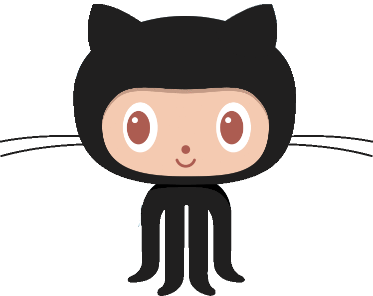

# Nishusk.github.io
### Hi there 👋 This is Nishu Kumari

  

 
 

<!-- https://quotes-github-readme.vercel.app/api?type=horizontal&theme=radical -->

# Let's Connect 

 
 
  
 

# About Me 

 I am Nishu Kumari, currently in my 3rd year pursuing a B.Tech in Computer Science Engineering from NIT MIZORAM.
 
 I am passionate about acquiring knowledge, coding, and problem-solving.
 
 Constantly expanding my skills and exploring new technologies.
 
 Adaptable and resourceful developer constantly adapting to emerging technologies and industry trends.
 
 Strangers are friends waiting to be made! Let's break the ice! Say **Hi** 👋, and let's discover common interests and ideas. [Here](https://www.linkedin.com/in/nishu-k-b7b34621a/)!
 

## Tech Stack

       

## GitHub Stats :

 
   
   

 

## GitHub Trophies

 

 

## Quine Stats:

 

 

## Top Contributed Repo

